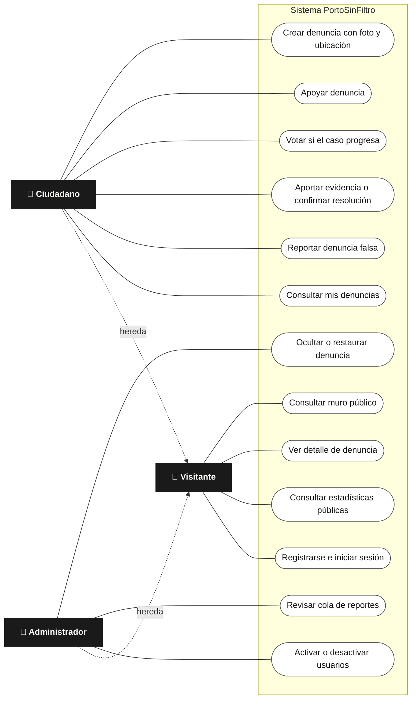
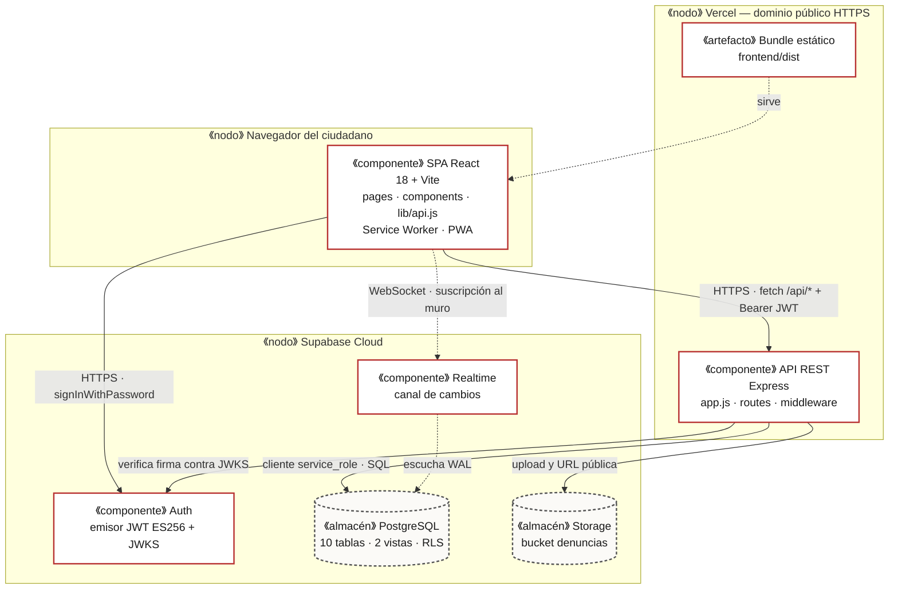
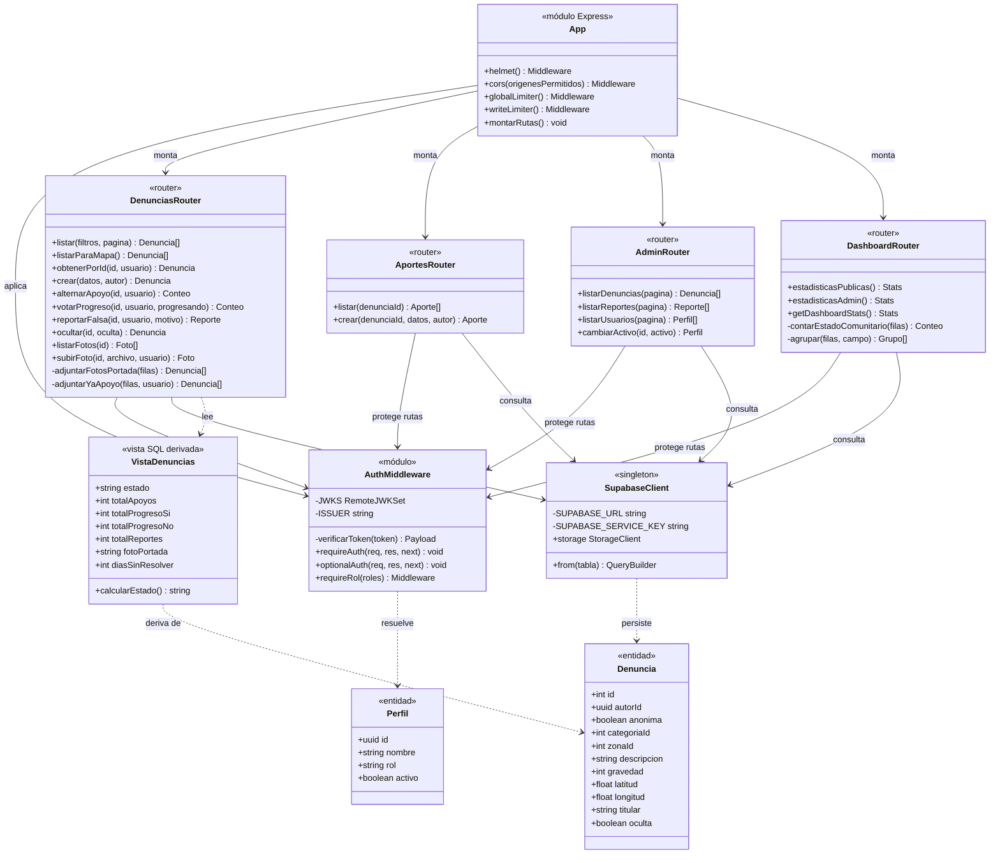
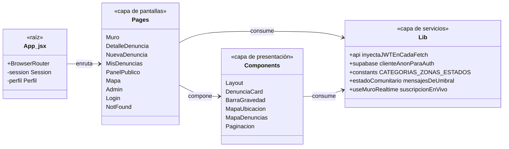
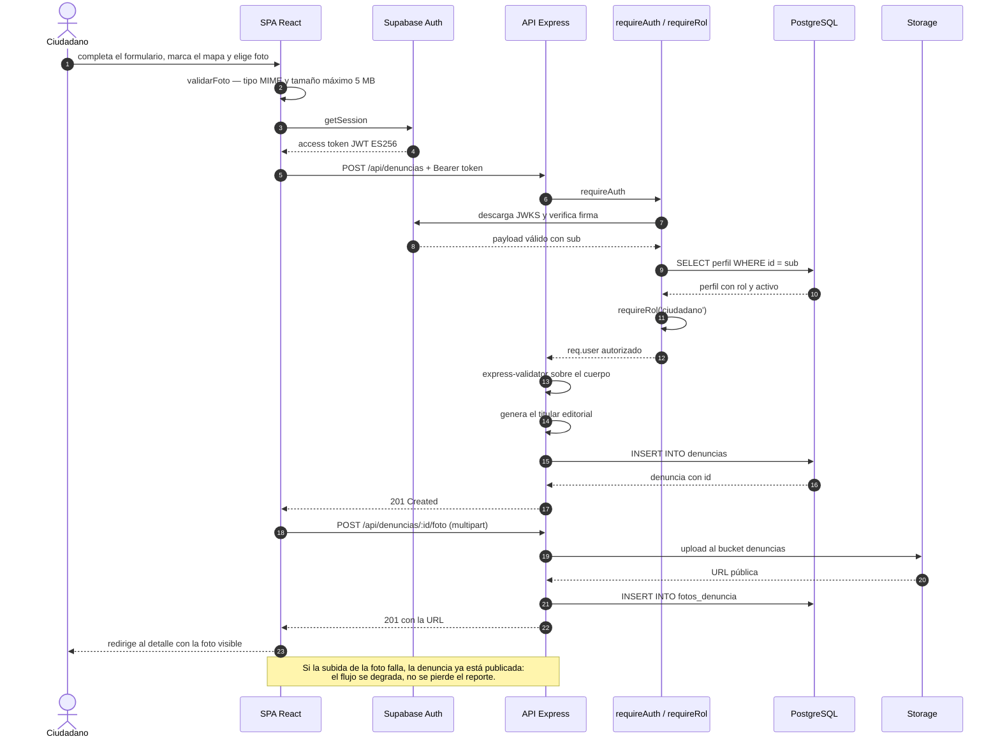
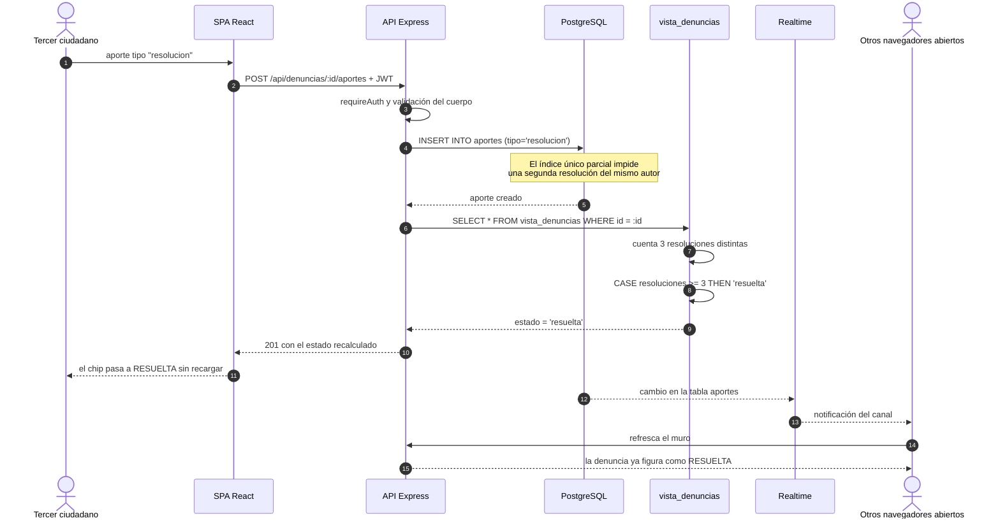
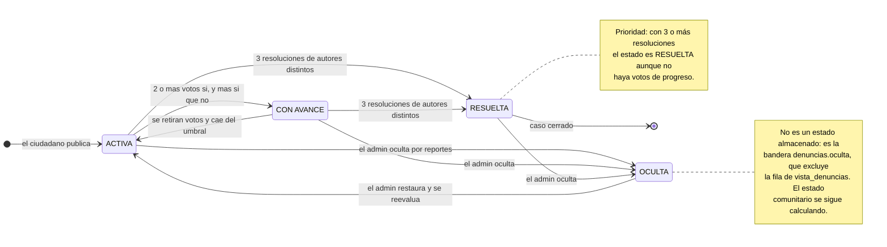
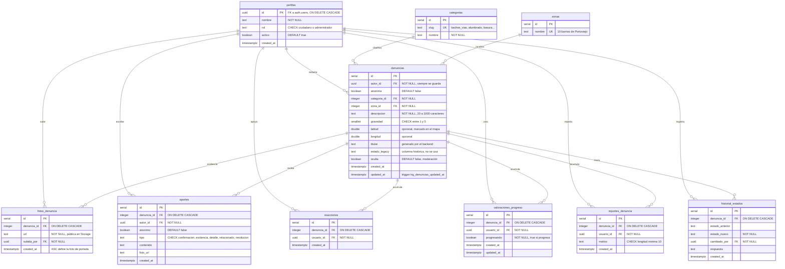

# Arquitectura y modelado — PortoSinFiltro

Documento técnico de arquitectura del proyecto **PortoSinFiltro — El Muro de la Vergüenza**.
PUCE Sede Manabí · Ingeniería de Software · *Desarrollo de Sistemas de Información* 2026-1.

Todos los diagramas están en **Mermaid**, que GitHub renderiza directamente en esta
página. El script de creación de la base de datos es [`database/BDD.sql`](../database/BDD.sql).

> 🖼️ **Para verlos fuera de GitHub** (imprimir, exportar a PDF o abrir en un editor sin
> soporte de Mermaid), generar los diagramas como imágenes vectoriales:
>
> ```bash
> npm run diagramas
> ```
>
> Deja en `docs/diagramas/` un `ARQUITECTURA.md` con los ocho diagramas como archivos
> `.svg` enlazados. Requiere Node y descarga `@mermaid-js/mermaid-cli` con `npx` la
> primera vez.

## Índice

1. [Metodología: elección y justificación](#1-metodología-elección-y-justificación)
2. [Diagrama de casos de uso (UML)](#2-diagrama-de-casos-de-uso-uml)
3. [Diagrama de componentes y despliegue (UML)](#3-diagrama-de-componentes-y-despliegue-uml)
4. [Diagrama de clases (UML)](#4-diagrama-de-clases-uml)
5. [Diagramas de secuencia (UML)](#5-diagramas-de-secuencia-uml)
6. [Diagrama de estados (UML)](#6-diagrama-de-estados-uml)
7. [Modelo relacional completo (DER / MR)](#7-modelo-relacional-completo-der--mr)
8. [Trazabilidad de artefactos](#8-trazabilidad-de-artefactos)

---

## 1. Metodología: elección y justificación

El equipo trabajó con **Scrum adaptado a sprints cortos de dos semanas**.

### Por qué Scrum y no otra alternativa

| Alternativa | Por qué se descartó |
|---|---|
| **Kanban** | Es flujo continuo sin compromiso por iteración. Nuestro alcance estaba fijado de antemano por la rúbrica y la fecha de examen era inamovible, así que necesitábamos una meta cerrada y demostrable por sprint, no un flujo abierto. |
| **Cascada** | Exige requisitos congelados al inicio. Los nuestros cambiaron de raíz a mitad del proyecto: pasamos de un modelo donde el municipio cerraba las denuncias a uno donde el estado lo calcula la comunidad. Cascada habría obligado a rehacer el análisis completo. |
| **XP** | Sus prácticas centrales (programación en pareja continua, TDD estricto) no eran viables con cinco integrantes en horarios distintos y sin poder trabajar de forma sincrónica. |

### Cómo se aplicó

| Artefacto Scrum | Implementación concreta |
|---|---|
| **Product Backlog** | Proyecto `SCRUM` en Jira, priorizado por dependencia técnica: base de datos antes que API, API antes que interfaz. |
| **Épicas** | Una por módulo del sistema: autenticación y usuarios, registro de denuncias, muro público, seguimiento ciudadano, anonimato y moderación, estadísticas, infraestructura. |
| **Sprint Backlog** | Tickets con responsable único y criterios de aceptación verificables. |
| **Flujo de estados** | `Por hacer` → `En progreso` → `En revisión` (PR abierto y CI en verde) → `Finalizado`. |
| **Definition of Done** | Mergeado en `main`, CI en verde, y flujo validado en la aplicación desplegada. |
| **Dependencias** | Enlaces `is blocked by` entre tickets de módulos distintos. |

**Roles.** Sin Scrum Master dedicado por el tamaño del equipo: la facilitación fue rotativa
y la propiedad del backlog compartida. Cada integrante es dueño de un módulo y responsable
de los tickets de su épica.

**El registro de las iteraciones está en [`SPRINTS.md`](SPRINTS.md):** product backlog con
los requisitos `RF`/`RNF` por épica, y para cada una de las cuatro iteraciones su objetivo,
lo entregado, el sprint review y la retrospectiva. Incluye también el alcance planificado
que **no** se entregó y por qué, y las consultas JQL para verificar cada cifra contra el
tablero.

**Tablero:** [Jira — portosinfiltro (`SCRUM`)](https://codificandote.atlassian.net/jira/software/projects/SCRUM/boards)
· reparto vigente de módulos en [`EQUIPO-Y-MODULOS.md`](EQUIPO-Y-MODULOS.md).

---

## 2. Diagrama de casos de uso (UML)

Actores en rectángulo, casos de uso en óvalo, frontera del sistema en el recuadro.



**Restricciones de autorización que impone el diagrama.** El administrador **no** hereda
los casos de uso del ciudadano: no puede crear denuncias ni votar, porque moderar y
participar son roles incompatibles. Y ningún actor tiene un caso de uso "cambiar estado
de la denuncia": ese estado es derivado, no editable (ver sección 6).

---

## 3. Diagrama de componentes y despliegue (UML)



### Decisiones de arquitectura

| Decisión | Motivo |
|---|---|
| **El frontend nunca escribe en la base de datos** | Toda mutación pasa por el backend, que verifica token y rol. Deja un único punto donde auditar la autorización. |
| **El backend usa la `service_role` key** | La `anon` key respeta RLS, lo que hace que un `INSERT` legítimo pueda fallar por una política. El backend aplica su propia autorización, explícita y testeable; RLS queda como segunda capa ante accesos directos a la base. |
| **Verificación por JWKS y no por secreto compartido** | Supabase firma con ES256 (asimétrico). El backend valida con la llave **pública**, así que no existe `JWT_SECRET` que se pueda filtrar, y la rotación de llaves es transparente. |
| **Realtime consumido directo por el frontend** | Es un canal de solo lectura sobre tablas ya públicas. Pasarlo por el backend habría exigido mantener WebSockets en funciones serverless sin ganar seguridad. |

---

## 4. Diagrama de clases (UML)

El backend es JavaScript modular con ES Modules, no orientado a objetos con clases
`class`. El diagrama modela cada **módulo** como una unidad con su interfaz pública,
que es la lectura equivalente en UML de un módulo funcional.



### Correspondencia entre operaciones y endpoints REST

| Módulo | Operación | Endpoint | Autorización |
|---|---|---|---|
| `DenunciasRouter` | `listar` | `GET /denuncias` | pública |
| | `listarParaMapa` | `GET /denuncias/mapa` | pública |
| | `obtenerPorId` | `GET /denuncias/:id` | `optionalAuth` |
| | `crear` | `POST /denuncias` | `requireRol('ciudadano')` |
| | `alternarApoyo` | `POST /denuncias/:id/apoyo` | `requireAuth` |
| | `votarProgreso` | `POST /denuncias/:id/progreso` | `requireRol('ciudadano')` |
| | `reportarFalsa` | `POST /denuncias/:id/reporte` | `requireRol('ciudadano')` |
| | `ocultar` | `PATCH /denuncias/:id/ocultar` | `requireRol('administrador')` |
| | `listarFotos` | `GET /denuncias/:id/fotos` | pública |
| | `subirFoto` | `POST /denuncias/:id/foto` | `requireAuth` |
| `AportesRouter` | `listar` | `GET /denuncias/:id/aportes` | pública |
| | `crear` | `POST /denuncias/:id/aportes` | `requireAuth` |
| `AdminRouter` | `listarDenuncias` | `GET /admin/denuncias` | `requireRol('administrador')` |
| | `listarReportes` | `GET /admin/reportes` | `requireRol('administrador')` |
| | `listarUsuarios` | `GET /admin/usuarios` | `requireRol('administrador')` |
| | `cambiarActivo` | `PATCH /admin/usuarios/:id` | `requireRol('administrador')` |
| `DashboardRouter` | `estadisticasPublicas` | `GET /dashboard/public` | pública |
| | `estadisticasAdmin` | `GET /dashboard` | `requireRol('administrador')` |

### Capas del frontend



---

## 5. Diagramas de secuencia (UML)

### 5.1 Crear una denuncia con foto



### 5.2 Confirmar resolución hasta que el estado cambia solo



---

## 6. Diagrama de estados (UML)

Ciclo de vida de una denuncia. Ninguna transición la dispara un administrador:
todas son consecuencia de evidencia ciudadana acumulada.



**Lectura clave para la defensa:** `ACTIVA`, `CON AVANCE` y `RESUELTA` **no existen como
dato**. Son el resultado de un `CASE` evaluado en cada lectura de `vista_denuncias`:

```sql
CASE
  WHEN resoluciones >= 3                              THEN 'resuelta'
  WHEN progreso_si >= 2 AND progreso_si > progreso_no  THEN 'con_avance'
  ELSE 'activa'
END AS estado
```

Consecuencia de diseño: es imposible que el estado quede desincronizado de la evidencia,
y es imposible falsear un cierre desde la aplicación. El costo asumido es recalcular en
cada lectura; a la escala del proyecto es despreciable y, con volumen, se resolvería con
una vista materializada refrescada por trigger.

---

## 7. Modelo relacional completo (DER / MR)

Diez tablas y dos vistas. Nueve tablas están en uso; `historial_estados` es una tabla de
legado que quedó del modelo anterior, en el que el municipio cambiaba el estado a mano, y
que el `BDD.sql` sigue creando para que el esquema sea reproducible tal como está
desplegado. Notación pie de cuervo: `||` uno obligatorio, `o{` cero o muchos.



### Restricciones de integridad que sostienen las reglas de negocio

| Regla de negocio | Restricción en el esquema |
|---|---|
| Un apoyo por persona y por denuncia | `UNIQUE (denuncia_id, usuario_id)` en `reacciones` |
| Un voto de progreso por persona y por denuncia | `UNIQUE (denuncia_id, usuario_id)` en `valoraciones_progreso` |
| Un reporte de falsedad por persona y por denuncia | `UNIQUE (denuncia_id, usuario_id)` en `reportes_denuncia` |
| Una sola confirmación de resolución por persona | Índice único **parcial** `aportes_una_resolucion_por_usuario` con `WHERE tipo = 'resolucion'` — permite varios aportes de otros tipos del mismo autor |
| El motivo de un reporte no puede ser vacío ni trivial | `CHECK (char_length(trim(motivo)) >= 10)` |
| La gravedad es una escala cerrada | `CHECK (gravedad BETWEEN 1 AND 5)` |
| Solo existen dos roles | `CHECK (rol IN ('ciudadano','administrador'))` |
| Borrar una denuncia no deja huérfanos | `ON DELETE CASCADE` en las seis tablas hijas |
| `updated_at` nunca se desactualiza | Trigger `trg_denuncias_updated_at` con `actualizar_updated_at()` |
| Todo usuario nuevo tiene perfil de ciudadano | Trigger `on_auth_user_created` sobre `auth.users` → `handle_new_user()` |

### Vistas derivadas

| Vista | Diferencia | Consumidores |
|---|---|---|
| `vista_denuncias` | Excluye `oculta = true`. Aplica anonimato: si `anonima`, devuelve `NULL` en `autor_id` y `'Ciudadano Anónimo'` en `autor_nombre`. Calcula `estado`, `total_apoyos`, `total_aportes`, `total_fotos`, `total_progreso_si`, `total_progreso_no`, `total_reportes`, `foto_portada` y `dias_sin_resolver`. | Muro, detalle, panel público, mapa |
| `vista_denuncias_admin` | Idéntica pero **incluye** las ocultas. | Cola de moderación `/admin` |

### Seguridad a nivel de fila

RLS está activo en ocho de las diez tablas. Quedan fuera `categorias` y `zonas`, que son
catálogos públicos de solo lectura sin datos de usuario. El backend usa la `service_role`
key y bypassa RLS por diseño, así que RLS funciona como **segunda capa** ante un acceso
directo a la base con la `anon` key.

| Política | Tabla | Para qué existe |
|---|---|---|
| `lectura_publica_denuncias` | `denuncias` | Lectura pública de las no ocultas (`oculta = false`) |
| `lectura_publica_aportes` | `aportes` | Lectura pública de los aportes |
| `usuarios_ven_su_perfil` | `perfiles` | Que el frontend lea el nombre y rol del usuario autenticado, y solo el suyo |
| `lectura_publica_reacciones` | `reacciones` | Realtime respeta RLS: sin `SELECT` público el muro en vivo no recibe eventos |
| `lectura_publica_valoraciones` | `valoraciones_progreso` | Ídem, para los votos de progreso |
| `lectura_publica_fotos` | `fotos_denuncia` | Ídem, para las fotos |

Las tres últimas existen porque **Realtime evalúa RLS antes de emitir un evento**: una
tabla sin `SELECT` público no notifica cambios aunque esté en la publicación. Es la razón
por la que el muro en vivo depende de policies y no solo de la suscripción.

---

## 8. Trazabilidad de artefactos

| Artefacto exigido | Ubicación |
|---|---|
| Script estructurado de creación de base de datos | [`database/BDD.sql`](../database/BDD.sql) |
| Migraciones incrementales | `database/migracion_*.sql` |
| Datos de prueba | [`database/seed.sql`](../database/seed.sql) |
| Diagrama de casos de uso (UML) | Sección 2 de este documento |
| Diagrama de componentes y despliegue (UML) | Sección 3 |
| Diagrama de clases (UML) | Sección 4 |
| Diagramas de secuencia (UML) | Sección 5 |
| Diagrama de estados (UML) | Sección 6 |
| Diagrama entidad-relación (DER / MR) | Sección 7 |
| Justificación de la metodología | Sección 1 |
| Artefactos ágiles: backlog, sprint review y retrospectiva | [`docs/SPRINTS.md`](SPRINTS.md) |
| Diapositivas de sustentación | [`docs/presentacion/index.html`](presentacion/index.html) |
| Suite de pruebas | `backend/tests/` y `frontend/src/**/*.test.{js,jsx}` |
| Integración continua | [`.github/workflows/ci.yml`](../.github/workflows/ci.yml) |
| Guía de despliegue | Sección *Deploy* del [`README.md`](../README.md) |
| Reparto de módulos y tablero | [`EQUIPO-Y-MODULOS.md`](EQUIPO-Y-MODULOS.md) |
